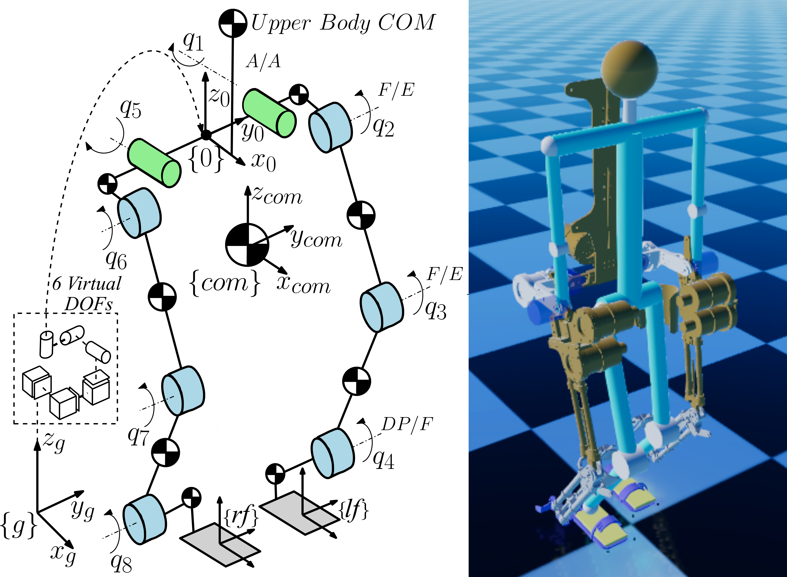
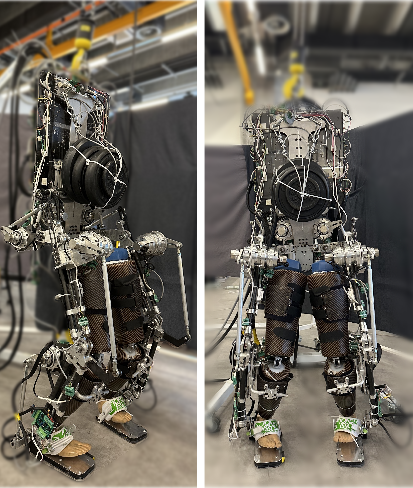

<!DOCTYPE html>
<html lang="en">

<h2>Code Capsule: Inertial Parameter Identification Experiments</h2>
<h3>Author information has been removed for double-blind peer review.</h3>

<h3>General Information</h3>

This repository reproduces the results and plots reported in the corresponding paper. The project involves generating curves from a set of simulation and hardware experiments to verify the feasibility of a proposed online inertial parameter identification algorithm.

<h3>Simulation Experiments</h3>

The algorithm is applied to an assistive bipedal lower-body exoskeleton, with an integrated human model, as shown in Figure 1. In this exoskeleton, each leg has 4 degrees of freedom (DoF):

<ul>
<li>2 DoF at the hip joint (Abduction/Adduction and Flexion/Extension axes),</li>
<li>1 DoF at the knee joint (Flexion/Extension axis), and</li>
<li>1 DoF at the ankle joint (Dorsi-Plantar/Flexion axis).</li>
</ul>

A human model with 26 passive DoFs (8 DoF in the legs, 5 DoF in the arms) is coupled to the exoskeleton via cuffs. This combined model is simulated using RaiSim simulator, written in C/C++ with the GNU Scientific Library, for various human models with different inertial parameters.

Figure 1: Left: Joint configuration of the bipedal exoskeleton and keyframe definition. Right: Its simulation model in RaiSim.

The simulation was run 72 times for 12 different anthropomorphic subjects, each performing forward walking at six different velocities (80, 90, 100, 110, 120, and 130 mm/s). The anthropometric data for the subjects is provided in Table 1, and the exoskeleton’s mass is approximately 40 kg.

<table border="1" cellpadding="10" cellspacing="0">
  <thead>
    <tr>
      <th>Subject</th>
      <th>Height (cm)</th>
      <th>Breadth (cm)</th>
      <th>Mass (kg)</th>
    </tr>
  </thead>
  <tbody>
    <tr><td>S1</td><td>181</td><td>46</td><td>66</td></tr>
    <tr><td>S2</td><td>175</td><td>47</td><td>75</td></tr>
    <tr><td>S3</td><td>170</td><td>49</td><td>80</td></tr>
    <tr><td>S4</td><td>172</td><td>49</td><td>80</td></tr>
    <tr><td>S5</td><td>183</td><td>49</td><td>81</td></tr>
    <tr><td>S6</td><td>177</td><td>50</td><td>87</td></tr>
    <tr><td>S7</td><td>187</td><td>50</td><td>89</td></tr>
    <tr><td>S8</td><td>190</td><td>51</td><td>91</td></tr>
    <tr><td>S9</td><td>183</td><td>51</td><td>95</td></tr>
    <tr><td>S10</td><td>185</td><td>53</td><td>102</td></tr>
    <tr><td>S11</td><td>190</td><td>52</td><td>102</td></tr>
    <tr><td>S12</td><td>170</td><td>47</td><td>70</td></tr>
  </tbody>
</table>

Table 1: Anthropometric data of the simulated subjects.

<h3>Hardware Experiments</h3>

The proposed identification algorithm is also experimentally verified using the in-house constructed bipedal exoskeleton with an integrated passive dummy (Figure 2). The exoskeleton is equipped with eight series elastic actuators on the active joints, each with two encoders to measure angular displacement and spring deflection. Force-sensitive resistors (FSR) are installed on each foot sole to measure ground reaction forces, while an inertial measurement unit (IMU) at the pelvis records angular velocity and linear acceleration.

    
    
Figure 2: The bipedal exoskeleton prototype, supporting a passive dummy manikin.

<h3>Figures Description and Regeneration Instructions</h3>

The MATLAB code was developed and tested on Ubuntu Linux. Users running the code on Windows may need to replace Unix-style path separators (/) with Windows-compatible paths or use fullfile().

The figures from the corresponding paper are listed in the second column of Table 2.  All figures were generated using MATLAB R2024b.   

 
To regenerate the figures, follow these steps:   
1. Open MATLAB.   
2. Navigate to the `code` folder.   
3. Run the `main()` function in the MATLAB command window.   
 
The `main()` function accepts up to three input arguments (`i1`, `i2`, and `i3`), which are defined separately for each figure.  
Refer to the fourth column of Table 2 for the required input arguments to reproduce each figure. Figures labeled 1S–6S correspond to figures in the supplementary material.

<table border="1" cellpadding="10" cellspacing="0">
  <thead>
  <tr>
  <th>Figure</th>
  <th>Description</th>
  <th>Figure Index in the Manuscript or Supplementary File</th>
  <th>Regeneration Code</th>
  </tr>
  </thead>
  <tbody>
  <tr><td>1</td><td>Left: Relative error $e_{rel}$ for simulation runs with and without a filtered regressor. Right: Relative error $e_{rel}$ for different filter cutoff frequencies $\gamma$.</td><td>3</td><td>$main(i_1)$   $i_1 = 3$</td></tr>

  <tr><td>2</td><td>Computation time $t_c$ and relative error $e_{rel}$ across the three methods.</td><td>4</td><td>$main(i_1)$   $i_1 = 4$</td></tr>

  <tr><td>3</td><td>Estimated right leg joint torques $\hat{\mathbf{\tau}}$ versus actual torques $\mathbf{\tau}_{act}$ and initial guess torques $\check{\mathbf{\tau}}$.</td><td>5</td><td>$main(i_1,i_2,i_3)$   $i_1 = 5$  $i_2 \in \{1,2,\dots,12\} \subset \mathbb{Z}$   $i_3 = [i_{3,1}, i_{3,2}] \in \{80,90,100,110,120,130\}^2 \subset \mathbb{Z}^2$</td></tr>

  <tr><td>4</td><td>Estimated (proposed) right leg null-space-projected joint torques $\tilde{\tau}^{est}$ versus the measured null-space-projected joint torques $\tilde{\tau}^{act}$.</td><td>7</td><td>$main(i_1,i_2)$   $i_1 = 7$   $i_2 \in \{1,2,3,4\}$</td></tr>

  <tr><td>5</td><td>(a) Experimental robot-joint absolute torque errors. (b) Experimental computation time tc.</td><td>8</td><td>$main(i_1)$   $i_1 = 8$</td></tr>

  <tr><td>6</td><td>Representative hardware experiment convergence. (a) Convergence metric $d_\pi(t)$. (b) Hip-link mass estimate.</td><td>9</td><td>$main(i_1,i_2)$   $i_1 = 9$   $i_2 \in \{1,2,3,4\}$</td></tr>

  <tr><td>7</td><td>Mean $\pm$ SD performance of the identification methods: (a) torque RMSE and (b) computation time.</td><td>10</td><td>$main(i_1)$   $i_1 = 10$</td></tr>

<tr><td>8</td><td>Computation time $t_c$ for two models walking with different velocities over different simulation runs.</td><td>1S</td><td>$main(i_1,i_2)$   $i_1 = '1S'$   $i_2 = [i_{2,1}, i_{2,2}]  \in \{1,2,\dots,12\}^2 \subset \mathbb{Z}^2$</td></tr>
<tr><td>9</td><td>Relative error $e_{rel}$ for four models walking with different velocities over different simulation runs.</td><td>2S</td><td>$main(i_1,i_2)$   $i_1 = '2S'$   $i_2 = [i_{2,1}, i_{2,2}, i_{2,3}, i_{2,4}] \in \{1,2,\dots,12\}^4 \subset \mathbb{Z}^4$</td></tr>
<tr><td>10</td><td>Variation of the estimated inertia-tensor eigenvalues and corresponding triangle-inequality conditions during a representative simulation run.</td><td>3S</td><td>$main(i_1,i_2,i_3)$   $i_1 = '3S'$   $i_2 \in \{1,2,....,12\} \subset \mathbb{Z}$   $i_3 \in \{80,90,100,110,120,130\} \subset \mathbb{Z}$</td></tr>
<tr><td>11</td><td>Estimated masses of the floating base, hip, thigh, shank, and foot $m_{fb}, m_h, m_{th}, m_{sh},$ and $m_f$. Mean ± STD is shown with shaded areas and mean values with solid lines.</td><td>4S</td><td>$main(i_1,i_2)$   $i_1 = '4S'$   $i_2 \in \{1,2,\dots,12\} \subset \mathbb{Z}$ </td></tr>
<tr><td>12</td><td>Experimental variation in estimated link inertia tensor eigenvalues and triangle inequalities.</td><td>5S</td><td>$main(i_1,i_2)$   $i_1 = '5S'$   $i_2 \in \{1,2,3,4\} \subset \mathbb{Z}$</td></tr>
<tr><td>13</td><td>Experimental variation in estimated link masses.</td><td>6S</td><td>$main(i_1,i_2)$   $i_1 = '6S'$   $i_2 \in \{1,2,3,4\} \subset \mathbb{Z}$</td></tr>

  </tbody>
  </table>
  
$\mathbf{Table 2}$: Description of figures included in the repository. $\mathbf{Column 1:}$ Figure index in the capsule. $\mathbf{Column 2:}$ Description of the figure content. $\mathbf{Column 3:}$ Corresponding figure number in the manuscript or supplementary file. $\mathbf{Column 4:}$ Instructions to run the figure using the $main()$ function, including required input arguments and their constraints. The set {1,2,…,12} denotes the simulated subject index, {80,90,100,110,120,130} denotes the walking velocity in mm/s, and {1,2,3,4} denotes the representative squatting-experiment index.
  

<h3> Authors </h3>
Author information has been removed for double-blind peer review.
